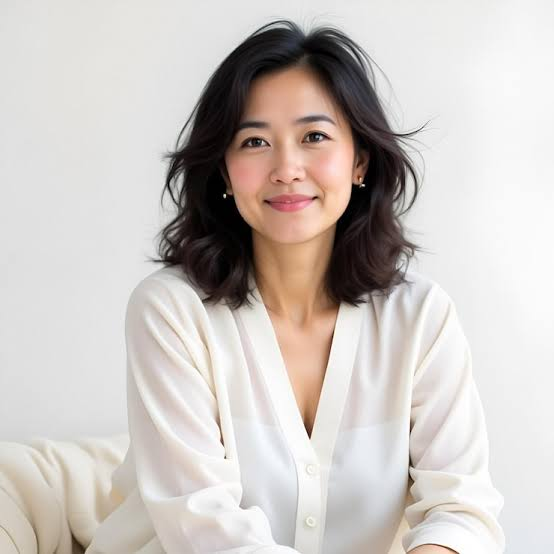

# Project_0831
새벽 프로젝트 테스트

---

## 자기소개

안녕하세요! 저는 **최윤정**입니다. 1984년생으로 올해 마흔둘이 되었고, 광주에서 나고 자라 지금은 서울 여의도 근처에서 지내고 있습니다.

### 하는 일

경영학을 전공한 뒤 글로벌 컨설팅펌에서 커리어를 시작해 15년 넘게 마케팅·전략 분야에서 일해왔습니다. 지금은 중견 브랜드 기업에서 마케팅본부장을 맡아 브랜드 전략 수립부터 팀 운영까지 총괄하고 있습니다. 여러 산업을 넘나들며 쌓은 인사이트를 바탕으로 데이터에 기반한 의사결정을 중요하게 여기며 일합니다.

### 성격과 가치관

목표가 정해지면 흔들림 없이 끝까지 밀어붙이는 편이지만, 팀원들의 의견을 충분히 듣고 함께 결정하는 것을 더 중요하게 생각합니다. 완벽주의보다는 속도와 실행력을 우선시하고, 실패를 두려워하기보다 거기서 배우는 태도를 지향합니다. 일과 삶의 균형을 스스로 지켜야 오래갈 수 있다는 걸 여러 번의 번아웃을 겪으며 깨달았고, 지금은 그 균형을 팀원들에게도 권하고 있습니다.

### 취미와 관심사

- **골프**: 주말마다 라운딩을 돌며 동료, 친구들과 네트워킹도 겸합니다.
- **와인 공부**: 소믈리에 자격까지는 아니어도 꾸준히 와인 클래스에 다니며 취향을 넓히고 있습니다.
- **필라테스**: 체력 관리와 자세 교정을 위해 주 3회 꾸준히 다니고 있습니다.
- **독서 모임**: 경영·인문 서적을 함께 읽고 토론하는 소모임을 오랫동안 이끌고 있습니다.

### 앞으로의 목표

가까운 목표는 지금 맡은 브랜드를 업계 1위로 올려놓는 것이고, 장기적으로는 후배 여성 리더들을 위한 멘토링 프로그램을 만들어 제가 받았던 도움을 되돌려주고 싶습니다. 언젠가는 제 이름을 건 컨설팅 회사를 차려보는 것도 마음 한켠의 꿈입니다. 이 프로젝트에서도 새로운 시도들을 이어가 보겠습니다. 잘 부탁드립니다!
