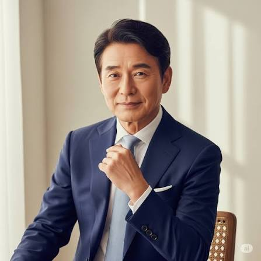

# Project_0831
새벽 프로젝트 테스트

---

## 자기소개

안녕하세요! 저는 **박정호**입니다. 1964년생으로 올해 예순둘이 되었고, 대구에서 나고 자라 지금은 서울 강남에서 지내고 있습니다.

### 하는 일

기계공학을 전공하고 대기업 제조회사에 입사해 35년 넘게 몸담아 왔습니다. 생산관리, 해외법인장을 거쳐 지금은 그룹 계열사의 대표이사로 재직 중입니다. 오랜 현장 경험을 바탕으로 원칙을 지키면서도 유연하게 판단하는 것을 경영의 기본으로 삼고 있습니다.

### 성격과 가치관

한번 맡은 일은 끝까지 책임지는 것을 원칙으로 삼고 있으며, 사람을 대할 때는 격식보다 진심을 우선합니다. 오랜 세월 여러 위기를 넘기며 조급함보다는 큰 그림을 보는 안목이 중요하다는 것을 배웠고, 후배들에게는 실패를 두려워하지 말고 경험을 쌓으라고 늘 강조합니다. 가정과 회사, 어느 한쪽도 소홀히 하지 않으려 애써온 것을 스스로 자랑스럽게 여깁니다.

### 취미와 관심사

- **골프**: 젊은 시절부터 이어온 취미로, 지금도 주말이면 라운딩을 즐깁니다.
- **등산**: 관악산, 청계산 등 근교 산을 오르며 체력과 마음을 다스립니다.
- **서예**: 몇 해 전부터 배우기 시작해 지금은 사무실에 직접 쓴 글귀를 걸어둘 정도로 애정을 쏟고 있습니다.
- **손주와 시간 보내기**: 바쁜 와중에도 손주들과 보내는 주말만큼은 꼭 지키려 합니다.

### 앞으로의 목표

가까운 목표는 지금 맡은 회사를 안정적으로 다음 세대 경영진에게 물려주는 것이고, 장기적으로는 그동안 쌓은 경영 노하우를 후배 경영자들에게 나누는 자문 역할을 하고 싶습니다. 은퇴 후에는 청년 창업가들을 돕는 일에도 힘을 보태고 싶은 바람이 있습니다. 이 프로젝트에서도 새로운 도전을 이어가 보겠습니다. 잘 부탁드립니다!
